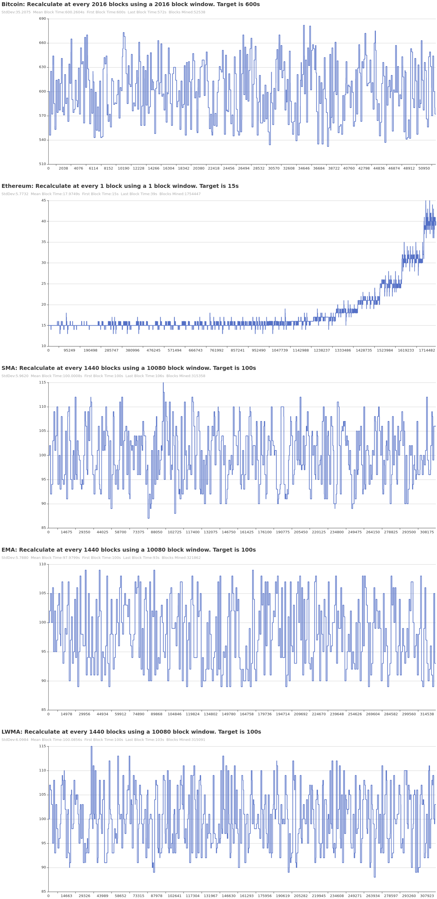

# Difficulty Simulator

[](https://github.com/seanvaleo/dsim/actions)
[](https://goreportcard.com/report/github.com/seanvaleo/dsim)

Simulate the effectiveness of various blockchain difficulty algorithms in terms of volatility and accuracy.


### Background

In a decentralized proof-of-work blockchain, where no individual controls the timing of block additions, there
must be a mechanism set in place in order to regulate the desired block frequency.

A so-called 'difficulty adjustment algorithm' can be used to adjust the difficulty of mining a new block,
based on an estimate of the network's total problem solving power. With all things being equal, the
block time should approach and maintain its target block time.

The goal of this project is to provide a simulator to report on the effectiveness of various
difficulty algorithms by observing the standard deviation, and mean values of all block intervals
after adding X blocks.




### Usage

Install Dependencies:
- [Go](https://golang.org/doc/install)
- [Git](https://git-scm.com/download)

Build and Run:
```
git clone git@github.com:mesosoftware/blockchain-difficulty.git
cd blockchain-difficulty
go build -o simulate cmd/main.go
./simulate
```

Configure global settings using environment variables in the project's `.env` file. Default values:
```
```

Configure algorithm parameters in `cmd/main.go`.


### Algorithms

This project ships with examples of the following algorithms, some of which are parameterized for tuning:

- Bitcoin
- Ethereum (Homestead)
- ASERT
- Digishield
- LWMA
- EMA
- SMA


### Design Decisions

1) Network power variability is expressed in terms of one value for net mining power. In the real world, network power varies due to a) miners going on/offline, and b) miners having differing computational power. The reasons for the change don't matter to us, we only care about simulating net overall change.
2) Solve time is perfectly correlated to difficulty. In the real world, even with a constant difficulty and network mining power, blocks are solved in an arbitrary amount of time, due to the probablistic nature of the typical PoW mining process. This doesn't matter to us, because on average, block solve time is correlated to difficulty.
3) With the default configuration, the difficulty is initialized to generate the perfect block time for the initial network mining power. As the mining power fluctuates throughout the simulation, the difficulty is adjusted per the selected algorithm. The simulator reports on the standard deviation in block generation times intervals over X blocks. If you wish to also factor in the effectiveness of an algorithm when the initial block difficulty is initially inappropriate for the mining power, that is configurable.
4) With the default configuration, the network mining power can fluctuate by up to 25% per day. This seems to be normal for the Bitcoin blockchain in 2023. This daily fluctation limit is configurable. 


### Research

- [Difficulty Wiki](https://en.bitcoin.it/wiki/Difficulty)
- [Why the Bitcoin target block time is 10 minutes](https://bitcoin.stackexchange.com/questions/1863/why-was-the-target-block-time-chosen-to-be-10-minutes)
- [Why the Bitcoin adjustment interval is 2 weeks](https://bitcoin.stackexchange.com/questions/65868/why-was-it-chosen-to-adjust-difficulty-every-2-weeks-rather-than-2-days-or-ever)
- [Summary of Difficulty Algorithms](https://github.com/zawy12/difficulty-algorithms/issues/50)
- [Live BTC statistics](https://siastats.info/mining)
- [LWMA algorithm](https://github.com/zawy12/difficulty-algorithms/issues/3)
- [ASERT/others](https://reference.cash/protocol/blockchain/proof-of-work/difficulty-adjustment-algorithm)
- [ETH Homestead](https://ethereum.stackexchange.com/questions/5913/how-does-the-ethereum-homestead-difficulty-adjustment-algorithm-work)
- [ETH Homestead](https://blog.cotten.io/ethereums-eip-2-4-15-second-block-target-98d4c11017e1)
- [ETH Homestead](https://copyprogramming.com/howto/how-does-the-ethereum-homestead-difficulty-adjustment-algorithm-work)
- [ETH Homestead](https://ethereum.stackexchange.com/questions/1880/how-is-the-mining-difficulty-calculated-on-ethereum)
- [Digishield](https://dgbwiki.com/index.php?title=DigiShield)
- [Digishield](https://github.com/zawy12/difficulty-algorithms/issues/7)
- [Bitcoin Proof-of-Work](https://github.com/bitcoin/bitcoin/blob/master/src/pow.cpp)
- [ETH DAA Implementation](https://github.com/ethereum/go-ethereum/blob/81d328a73e00454912edf79e74f7d041467fa2aa/consensus/ethash/difficulty.go#L82)
- [Attacks](https://old.reddit.com/r/Bitcoin/comments/mtugta/mentor_monday_april_19_2021_ask_all_your_bitcoin/gv86j6b/?context=5)


